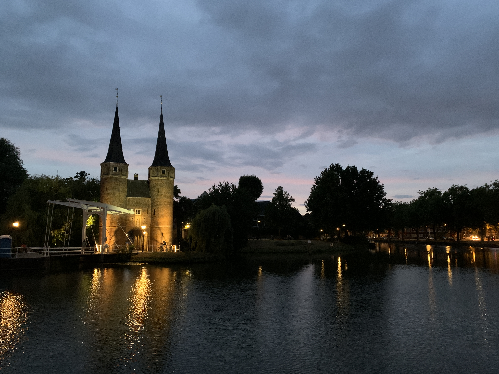
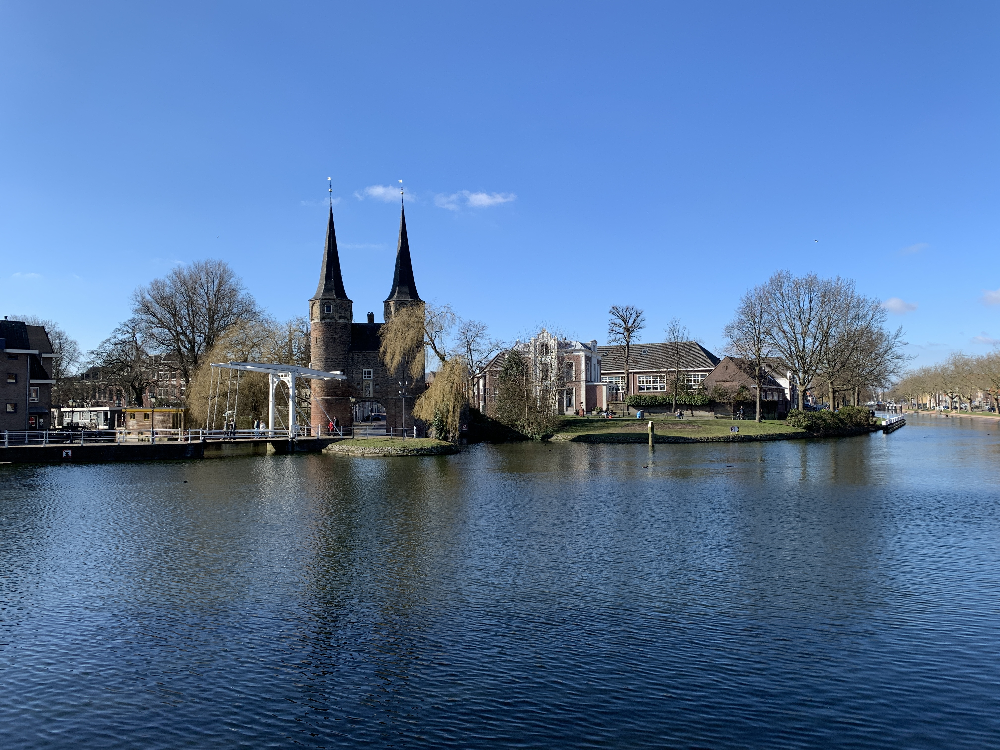

9月5日，周一，新生开学第一天早上。我在大为的陪同下到火车站，准备去阿姆做核酸。新生们从四面八方涌到车站，乘着公交车，电车，火车过来，一个个背着书包，脸上洋溢着对新生活的向往。我从扶梯下行，望着上行的这些朝气勃勃的面孔，感叹着“一替新人换旧人”。回忆起两年前的自己，又想到自己不知何时才能故地重游，心里五味杂陈。回首这两年在代尔夫特的日子，当初绝对不会考虑到，自己会和这座城市和城里的人有这么多羁绊，这么多感情。

在我被学校录取前，我对代尔夫特这个小城完全没有了解。得知自己被录取后，也不过是随手翻了翻维基百科上的介绍，知道它是荷兰历代皇室的安息之地，画家维米尔的故乡，和中国瓷器长得相似的蓝瓷产地。从地图上看，它夹在荷兰两大城市海牙和鹿特丹之间，离海边也不过十几公里。然而我出发之前，想到自己要在这样一个和老家市中心大小差不多的地方呆两年，便觉得有些和留学是要开阔视野的想法有些不符，自然觉得会憋屈无聊。

记得刚到的第一天，我和同学从火车站出来，迎接我们的就是荷兰特色大风夹杂小雨。我们顶着风雨，拉着行李箱，行李箱在积雨的石板路上隆隆作响，时不时溜到水坑里溅起水。大家都无暇去欣赏路边的小桥和运河，几分钟就到了宿舍楼下，匆匆办完入住手续。它给我留下的第一印象大概就是这样吧，小的可怜，天气又差。

每到一个新城市，如果它的大小允许，我喜欢以走路的方式去发现每一个角落的风景，顺带了解下城市的历史。从书上看到，代尔夫特意为“挖掘”，最开始是疏水用人工河道旁的定居点。后来随着修建了两条运河，连接到马斯河的Delftse Schie，和向北连接到莱顿的Delftsche Vliet，一条贯通代尔夫特南北的水路由此形成。1246年，代尔夫特被授予城市权利。从这之后，绕城的城墙和堡垒也开始建设，一处中世纪贸易节点诞生了。

城墙在从拿破仑手中获得独立时已被拆除，但还能从河道推算出当时的城市位置。19世纪末，为了转运更多的船只到内陆，政府在代尔夫特东侧原有的运河基础上扩建了Rhine-Schie运河。这条运河流经代尔夫特的这一段像一条南北走向的闪电，闪电北边部分的两条河段框着市中心，我的宿舍就在横着这部分河段南侧，每次去市中心要过桥去对面。南边部分沿河的则是学校建筑和一些工厂。

市中心，运河水灌入许多条小河道中，将城市纵横分割成不同区域，区域之间被各式的小桥连接，有石砖的，石板的，栏杆被漆成白色，有些桥的侧面还能看到它的建造日期。桥都很朴素，装饰仅仅是每侧栏杆上两大盆天竺葵，各色自行车散落地靠在栏杆上，也为桥添些色彩。这些桥宽窄不一，宽的能并排让车通行，窄的仅能过一人。中心广场被各式商店餐厅包围，市政厅和新教堂伫立在长方形广场的两端，游客们要么在坐咖啡店的室外座位上闲谈，要么站在广场中央抬头静静地端详教堂，广场上成群的鸽子们每天忙着寻找着游客掉落的面包屑，仿佛这一切和它们无关。

疫情间，为数不多能做的运动就是跑步，但我是一个觉得跑步十分枯燥的人，每次跑步路过市中心时，我都会变换着路线，试图看遍每一条街和每一条河，也给跑步增添一点新鲜感。然而它们是这样的相似以至于有时会迷路，同样布满青苔的狭窄河道，同样红石砖铺地的小路，同样橙色斜屋顶的低矮房子。随着一次次跑步，我不知道是天气变冷、阳光变少、植物凋零还是什么原因，觉得眼前的城市褪了色。

代尔夫特的冬天是难熬的，太阳在下午三四点就要跟你说再见，早上拉开窗帘它还迟迟不出现，一觉醒来跟没睡一样。更不用说阴冷多风的天气，和疫情带来的封锁导致街上见不到什么人，真的呆到自闭。每周只能靠和Tang约球来给自己大脑上发条，从一周一次到一周三四次，只有这样才能支撑着每天的学习任务。可能是受不了这阴沉的天气，以及对这个小地方的厌倦，在看到可以交换的通知时，我毫不犹豫就打算申请。没怎么斟酌，我就选择了位于南欧的意大利。填完网申后，我向后一倒，双手撑着后脑勺，闭上眼睛，仿佛已经躺在沙滩躺椅上，感受着来自地中海干燥的海风。

少有在代尔夫特看到下雪的时候。第一年冬天，有一次雪特别大，河水结上了冰，从窗外望去，已然白茫茫一片，房屋上的瓦都落上雪，只有不同层瓦的缝隙，没有被雪覆盖，形成波浪似的纹理。套上羽绒服下楼，鞋踩在雪上，发出吱嘎吱嘎的声音，让我怀念起在家的日子，只是这雪下面还藏着绿茵茵的细草。走在去学校的路上，宿舍楼下的停放的大批自行车，仿佛集体被套上了一层厚厚的泡沫，路上车很少，人行道上有荷兰的家长拉着塑料雪橇，上面载着全副武装的小孩子，孩子们高兴地挥舞着手臂，指挥着父母开往学校去。学校的图书馆在下雪的时候，屋顶斜坡就变成了滑雪场，附近的居民和学生来到这里，享受着雪上运动，学校似乎阻止不了他们对雪上运动的热情，干脆拉上一个蓝色的条幅，写着“enjoy the snow”。

三四月的代尔夫特终于露出了它可爱的一面，虽然树还没发芽，但花草早已嗅到了春天的气息。如果有人在一个天气好阳光足的下午在代尔夫特中心逛，他会看到草坪上、广场上、运河边都长满了晒太阳的人，像不小心撒在地上的一摊豆子。大家喝着咖啡或吃着集市上买的炸鱼薯条，享受着难得的惬意。随便在市中心兜上一圈，保准能看到不少熟悉的面孔，六度分隔理论放在这个城市范围，大概三度足矣。有一次和Tang边走边聊到我们同学，没走两步就在路口碰见那人，只好急忙转移话题到另一个人身上，又溜达了一会，这位被提到的人骑着自行车，按着铃铛，打着招呼从我们身边经过，我和Tang相视苦笑，再也不敢在路上随便讨论别人。

球场也终于迎来了新的面孔，女朋友在代尔夫特读博自己却在巴黎的印度保罗Bharath，打球嘴上从来不停的西班牙00后Bruno，会说中文的比利时字母哥Eliott，在冰岛打过职业的Einar，带着老婆孩子读书的印尼人Lanar，毕了业当地华为工作的大为。我的英语口语一大半是在这里练的，本专业的专业用语没怎么学会，trash talk倒是跟大家学了不少。

春天真美好，白天变长加上夏令时的关系，打球到晚上九点多钟都不会黑天。迎着夕阳，拍着球，散步回到某个人家里，路过超市，抄上几瓶啤酒，大家看着球赛，吹着牛X谈诗和远方。记得有次Bharath跟我们说：“巴黎并没有那么好，以后就想找个像代尔夫特一样的小地方住“。我笑他说：“巴黎还不好，代尔夫特这么小多无聊啊。”他笑着回我说：“等你再过几年大概就懂了。”

坏天气总会把你从春天的美好拉到现实。连绵不断的雨，阴沉黯淡的天。我的宿舍楼下旁就是墓地，一伙纹着身，穿着奇特的老年人每天在长椅边，点起油漆桶里的火堆，掰几片面包甩给聚集的鸽子，坐在电动轮椅上吸大麻。我总觉得他们在纪念什么，可能是之前葬在这里的帮派成员。每到下雨的时候，他们会躲在几步远的桥下，干着同样的事，这时我才有机会近距离观察他们。但每次经过桥，我都低着头，急匆匆从他们身边走过，生怕有人被我盯的不耐烦，斥喝我。雪和冰雹也是这段时间的常客。一个荷兰人跟我说，他们这边有句俗语"**April doet wat hij wil**"，翻译过来是“四月做它想做的任何事”。

八月末，结束了在西西里10天的假期，我抱着对大城市的憧憬来到米兰。打卡式地游览了那些著名景点，体验完热闹的夜生活和繁华的都市，然后呢，我并不是个能在短时间内建立一些朋友关系的人，没有人和我在球场互喷trask talk，不能在散步时随意碰见熟悉的面孔，地铁的轰隆声带乱了内心节奏。我试图用新鲜感填补这些空虚，有机会就去到意大利其他城市。当我来到威尼斯时，并没有我以为的那样惊奇，内心的一个声音告诉我：“这甚至没有代尔夫特精致特别”。《看不见的城市》里有一句话：人在远方的陌生城市中愈是觉得迷失，对于途中所经的其他城市愈能了解；然后他回溯旅程的各个阶段，开始认识他最初启航的城市。“对于马可波罗来说，那最初启航的城正是我脚下的威尼斯，而对我来说，那个城市是代尔夫特。

在米兰的最后一个月，我翘首以盼，期待走在石板路上，漫游在运河边，甚至开始想念荷兰的食物，集市卖的炸鱼薯条。

回到荷兰，不过多久就是夏天。代尔夫特的夏天，很长也很短。说它长是在时间上，从5月中旬能持续到9月。说它短是因为四季中只有这么一个令人心旷神怡，雨水不是很充沛的季节，恨不得它再长一些。夏天里，一切都充满了生机，疫情不再是人们的关注重点，各式活动如雨后春笋般展开。

河道上，除了经常会看到游艇上party的年轻人和划船的游客，还有人尝试着水上自行车和桨板，更有人直接把这里当作露天泳池，开始戏水游泳。餐厅小伙子们将桌椅从室内再次搬到屋外，有的还被移到门口停泊的船上。一到晚上，绕船上方一圈的黄色小灯，桌子中央的香烛，街边的路灯，天上的星月，相映成辉。每周六的二手市集异常热闹。摊位以广场为中心，向四周的街道铺开，遍布半个市中心。卖的东西也五花八门，从二手家具到旧首饰，再到唱片书籍，明信片地图，当然也少不了最具特色的瓷器。除去常见的碗碟杯瓶，也有诸如纹砖这样的装饰品。每次在摊位前把玩一样奇特的物品，老板都会热情地站起来，和你诉说它背后的故事。

如果别人问我在代尔夫特一个最喜欢的地点，那一定是Oostpoort。它是代尔夫特旧城墙拆剩下的一个城门。当时据说由于其“attractive appearance”，八个城门只有它被保留下来。两个十几米高的哥特式尖塔，灰色的尖顶，砖砌的塔体，两座尖塔中间也有一段短的连廊，连廊下面就是城门，大概有三四米宽。连廊外墙上还有一个守卫雕像，他身着盔甲斗篷，右手持长枪，左手提一盏灯笼，脚边还有一条小狗，陪他一起守护着这座宁静小城。城门外是一架新修的白色吊桥，升起后能让小船通过，进入到城市中的水道。城门坐落在运河的闪电形拐角，水域开阔，视野也开阔。选一个天气好的夏日傍晚，静静地坐在运河的另一侧，望着对岸的城门和它头顶的天空，真是一件美事。比起傍晚时粉色的晚霞，我更喜欢即将到来的夜空。11点左右，看向西边，太阳落山之后还倔强地投射着最后一条亮光，亮光从地平线上开始，在天空画幅上晕染开，天边的一丝丝橘黄，以白色连接，过渡到浅蓝色，再到头顶的深蓝色，像用颜色粗细不一的笔刷抹过一样。

在这里的最后一晚，我坐在Oostpoort对面的长椅上，一直到夜幕降临。我回忆着每个地点，每个瞬间。脑海中的城市，轮廓逐渐清晰。新老教堂，市政厅，运河，城门，图书馆。再填上色彩。蓝白色的瓷器主调，橙黄或灰蓝色的屋顶，粉红色的夏日晚霞，碧绿的草地，昏黄的路灯。这些组成了我代尔夫特的记忆。

