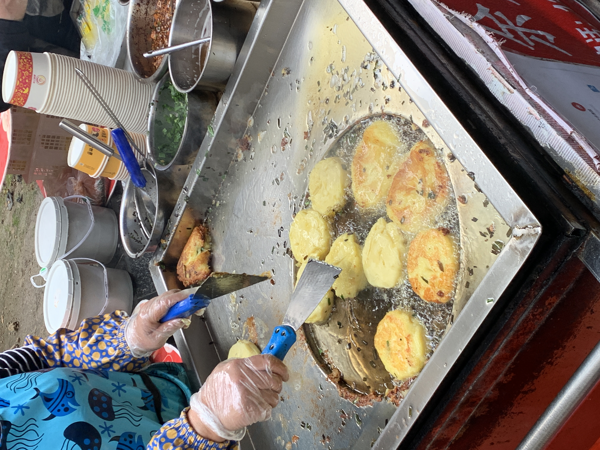

卖脆皮洋芋粑的小推车上，半边是各种蘸水调料，另半边是一个特制的煎制洋芋粑的操作台。这是个特殊的煎锅，或许不应该用煎锅来形容它，远看是个不锈钢的，带几厘米高围挡的四方带底框子，近看还能看见四角焊接的痕迹。细瞧之下，这框子中间还有个不小的圆形凹槽作为铛，能同时容纳十来块洋芋粑，高度也正好能让洋芋粑完全浸入油中。整个操作台的造型让我想起飞机高铁上的小桌板，平整的面板上凹下一个圆，只是煎锅上的圆要更大些。

只看这位嬢嬢双手同时操纵十来块洋芋粑，两只铲子上下翻飞，麻利痛快，宛如在战场上使用着趁手虎头双刀的顾大嫂，时而上下夹住煎好一面的粑翻个面，时而一铲把粑碾平，另一铲挑上些韭菜段再把粑对折起来。少有不需要顾及粑的时候，她或是处理掉飘溢到凹槽外面煎糊的韭菜段，或是用两个铲子帮彼此处理粘在上面的糊渣，再或放下手中的工具，弯腰从下面的篮子里掏出两三块接下来要下锅的粑。

一块洋芋粑直径将近十厘米，厚大概两公分，只是个平平无奇的土豆泥饼。它没下锅之前像是一块浅黄色的橡皮泥，颜色暗淡，质地柔软但毫无食欲，掏出来扔到不锈钢操作台上时还会发出啪嗒的声音。然而它遇到了油。遇到了让它滋滋作响，焦香四溢，光鲜耀眼成为主角的猪油，这块土豆泥饼便在色香味上涅槃重生。

刚出锅的洋芋粑被随意折叠两下装在一次性圆餐盒里，然而但它刚刚历经如此高温，好不容易蜕变拥有了外壳，似乎不想被人如此对待，于是支棱着半躺在盒子里。推车上的调料，酸萝卜，辣椒面，折耳根，甚至于甜面酱，都可以和它配着享用。萝卜块的酸和脆正好和洋芋粑形成了互补，酸解腻，脆显糯。辣椒这个能打破一切寡淡规则的香辛料，在这里也不例外，把粑粘满辣椒面，刚入口以为在吃麻辣香锅味的乐事，而合上牙齿抿一抿才明白自己上当了，藏在中间细腻软糯的粑这时才露出来，裹着辣椒面和辣椒粒，柔软中带着生猛。泡萝卜的蘸水少浇一些在粑的中心，稍稍调味，也化开没接触到油脂的那些粑。至于折耳根和甜面酱，对不起了，还是留给那些本地人和北京游客吧。